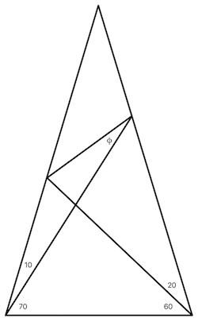

# Mathematics
Here you'll find an assortment of technical essays I've written over the years either as part of other research, or as teaching aids, or as pass-time exercises when I had nothing more interesting to occupy myself with. Nothing here is truly original, except perhaps for the presentation. Some of them are still works in progress.

##### (2022) [The Triangle Puzzle](https://github.com/wltrup/Math-Triangle-Puzzle)
I came across an interesting mathematical puzzle, namely, find the value of the angle 𝜙 in the triangle shown in the figure below. It turns out that it's a surprisingly non-trivial problem to solve. I like a mathematical challenge so... I solved a more general version of the problem, where the angles at the bottom are arbitrary.

##### (2020) [The Goat and The Fence](https://github.com/wltrup/Math-Fenced-Goat)
I just read an interesting mathematical puzzle. Suppose there is a goat inside of a circular fence of a given radius. If the goat has a leash attached to a point inside the fence, how long does the leash have to be so that the goat can graze through exactly **half** the total area inside the fence?

It sounded like a reasonably easy problem to solve and I had nothing better to do, so I solved it.

##### (2019) [Indexing Combinations](https://github.com/wltrup/Math-Indexing-Combinations)
How can we compute an index for a given combination of the *n* integers {1,2,3,...,n} taken *k* at a time? Also, given such an index, how can we recover the particular combination that has that index?

It turns out that there is a relatively easy-to-compute expression for the index of such a combination and there's a pretty efficient procedure to recover it, given its index.

##### (2018) [Exploring Turing Patterns](https://github.com/wltrup/Math-Exploring-Turing-Patterns)
I recently came across a fascinating article, [A Math Theory for Why People Hallucinate](https://www.quantamagazine.org/a-math-theory-for-why-people-hallucinate-20180730), describing recent attempts to mathematically model how the brain creates visual hallucinations. That article, in turn, pointed me to the subject of so-called *Turing patterns* and, in particular, to Turing's paper on morphogenesis as possibly being due to the interplay between diffusion processes and the competition between activating and inhibiting chemicals, [The Chemical Basis of Morphogenesis](http://www.dna.caltech.edu/courses/cs191/paperscs191/turing.pdf).

The potential applicability of Turing's hypothesis is mind-blowing. From how the patterns on the furs of animals form to how cells differentiate during the various phases of embryonic development and from how patterns form in sand dunes to how spiral arms form in galaxies, any time a process involves two competing entities (an activator and an inhibitor) spreading over space in a diffusive manner, the stage is set for Turing patterns to form.

From a purely mathematical point of view, Turing's paper is a particular application of a certain kind of partial differential equation. Mathematical physics has always been one of my favorite topics so I've decided to explore that same equation in a more systematic fashion than Turing's approach in that paper. I'm sure that nothing I'll be doing will be new but working through problems like this is fun, at least for me.

I went quite far but there's plenty that could be done still so this is work in progress.

##### (2015) [Grid Paths](https://github.com/wltrup/Math-Grid-Paths)
How many possible paths are there in a grid, if you're allowed only to move to the right or downwards and must avoid certain intersections?

I went as far as obtaining a result for 2 or fewer intersections to be avoided so, technically, this is still work in progress.

##### (2015) [Sphere Collision Detection](https://github.com/wltrup/Math-Sphere-Collision-Detection)
Suppose two spheres (of radii R1 and R2, respectively) are currently located at position vectors **r1** and **r2**, moving with velocity vectors **v1** and **v2**, respectively. Will they collide?

##### (2015) [Frank's Lunch Problem](https://github.com/wltrup/Math-Franks-Lunch-Problem)
Frank eats lunch 4 out of every 5 working days and spends a minimum of 5 pounds, a maximum of 15 pounds, with a most likely value of 8 pounds, per lunch. What is the distribution of possible lunch costs at the end of a work week?

I went quite far with this but there's still some work left to do so, technically, this is still work in progress.

##### (2015) [Coefficients of Average](https://github.com/wltrup/Math-Coefficients-of-Average)
Given a set of real positive numbers, how does one find a corresponding set of weights so that the weighted average of the given numbers equals a given value?

Of course, there are infinitely many solutions to this problem but there is a *unique* solution that minimizes the sum of the squares of the weights.

##### (2014/2015) [Tridiagonal Toeplitz and Tridiagonal *near* Toeplitz Matrices](https://github.com/wltrup/Math-Tridiagonal-Toeplitz-Matrices)
Last year I got interested in a particular kind of one-dimensional problem involving multiple point masses oscillating as if they were connected by springs. The problem of finding the normal modes of such a system reduces to diagonalizing a matrix of a special form, known as a [_Tridiagonal Toeplitz_](http://de.wikipedia.org/wiki/Tridiagonal-Toeplitz-Matrix) matrix. Not content with just looking up their eigenvalues, I decided to prove the result myself.

Almost a year later, a follow-up to that problem involved a small change to the physical system that propagated itself as a small change in the problem's tridiagonal Toeplitz matrix. As a result, the eigenvalues from the original problem no longer applied and I had to solve a whole new problem: finding the eigenvalues and eigenvectors of a tridiagonal matrix that is _almost_ Toeplitz (with a sensible definition of _almost_).

To my knowledge, this is an original result.

##### (2013) [Kalman Filtering Accelerometer Data](https://github.com/wltrup/Math-Kalman-Filtering-Accelerometer-Data)
At one point when I was working for [Hailo](https://www.hailoapp.com), I got to write a [_Kalman filter_](http://en.wikipedia.org/wiki/Kalman_filter).

##### (2011) [Square Roots and Irrational Numbers](https://github.com/wltrup/Math-Square-Roots-and-Irrational-Numbers)
A little essay I wrote when I had trouble sleeping one night. It proves that the only integer numbers whose square roots are rational numbers are the perfect squares. Nothing original here but a fun exercise nonetheless for sleepless nights.

##### (2007) [Fairest Voting System](https://github.com/wltrup/Math-Fairest-Voting-System)
The fairest voting system is one where no one _needs_ to vote! Ok, not quite.

##### (2006) [Solving Polynomial Equations](https://github.com/wltrup/Math-Solving-Polynomial-Equations)
[Evarist Galois](http://en.wikipedia.org/wiki/Évariste_Galois) has long proved that no polynomial equation of degree 5 or above can be solved in closed analytical form. Solving a quadratic equation, on the other hand, is trivial. How about polynomial equations of degrees 3 and 4? Here you will find the complete analytical solution for general polynomial equations of both degrees.

##### (2004) [B-Splines](https://github.com/wltrup/Math-B-Splines)
[B-Splines](https://en.wikipedia.org/wiki/B-spline) are specialized parametric curves useful in curve-fitting, numerical differentiation of data, and in computer graphics applications. Their parameters are defined recursively so, in this essay, I obtain the explicit parameters for B-splines of degree up to and including 4.

##### (2004) [Logistic Regression Classifier](https://github.com/wltrup/Math-Logistic-Regression-Classifier)
A heavily technical document I wrote for one of my jobs, in preparation for the design and implementation of an automatic multiclass document classifier. Originally written on April 21, 2004.

##### (2004) [Some Surprising Results in Linear Regression](https://github.com/wltrup/Math-Some-Surprising-Results-in-Linear-Regression)
While collaborating with a colleague on a paper in _Data Mining_, I found some interesting and surprising results in that old horse of statistics, _Linear Regression Analysis_.

##### (2001) [EM Algorithm for Gaussian Mixtures](https://github.com/wltrup/Math-EM-Algorithm-for-Gaussian-Mixtures)
The mathematical description of an implementation of the [Expectation-Maximization algorithm](http://en.wikipedia.org/wiki/Expectation–maximization_algorithm) applied to a mixture of Gaussian distributions.

##### (2001) [Minimum Distance Estimation for Gaussian Matrices](https://github.com/wltrup/Math-Minimum-Distance-Estimation-for-Gaussian-Matrices)
Here I apply to a mixture of Gaussian distributions the method of estimating parameters by minimizing a distance measure. To my knowledge, this is an original result.

##### (2001) [Computing Decision Boundaries](https://github.com/wltrup/Math-Computing-Decision-Boundaries)
Nothing original here but a complete analysis of what the decision boundary between classes in a classification problem looks like.

##### (2001) [Computing Multivariate Normal Contour Surfaces](https://github.com/wltrup/Math-Computing-Multivariate-Normal-Contour-Surfaces)
If you have data in many dimensions, what kind of multi-dimensional surface encompasses, say, 68% of the data?

##### (2000) [Principal Component Analysis](https://github.com/wltrup/Math-Principal-Component-Analysis)
This essay was written in preparation for a talk I gave in our research group at the _UC Irvine_’s _Data Mining_ group.

##### (2000) [Generative Bayesian Hierarchical Models for Individual Observations](https://github.com/wltrup/Math-Generative-Bayesian-Hierarchical-Models-for-Individual-Observations)
This is a mathematically heavy treatment of how generative Bayesian Hierarchical models can be used to estimate various properties of data obtained from individual observations.
